**T03 - SEGURETAT LÒGICA**
---
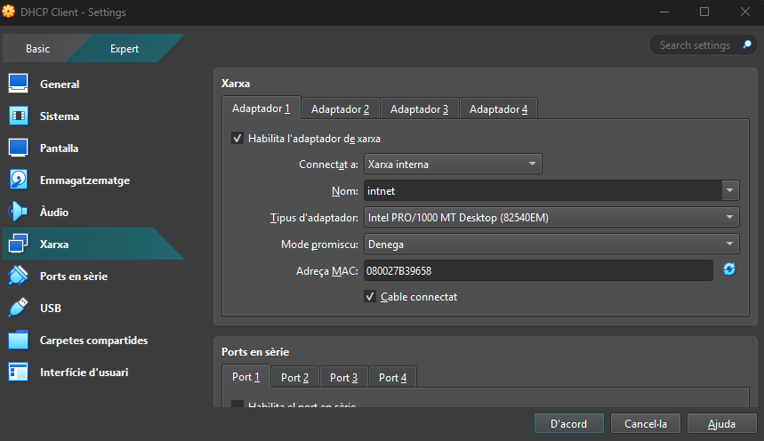

Abans de començar, anirem als paràmetres de la màquina i posarem el disc dur de seguretat

---

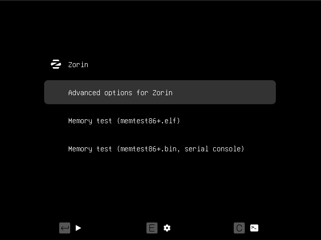

Al entrar a la màquina de Zorin, mantindrem el “shift” (↑) per accedir a aquest menú y anirem a les opcions avançades

---

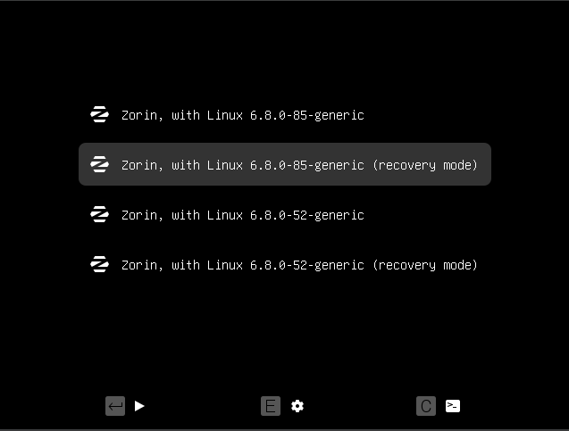

A les opcions avançades, hem de sel·eccionar la segona opció

---

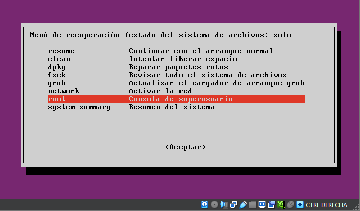

Anirem a l'opció de “root”

---

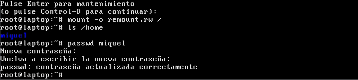

Amb el següent comandament podrem veure i identificar el nom de l’usuari. I amb la comanda “passwd (nom d’usuari)” podem canviar la contrasenya

---

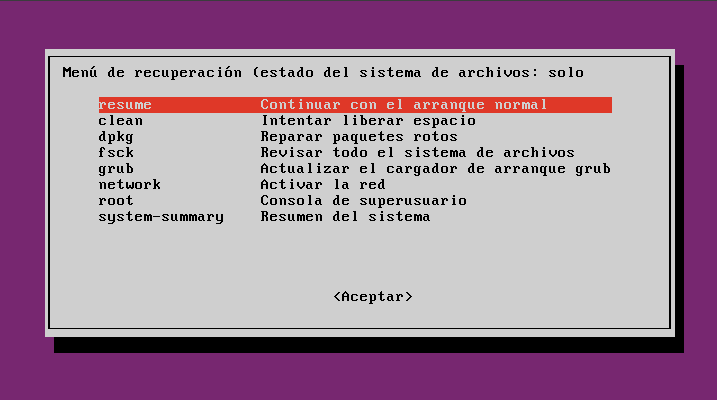

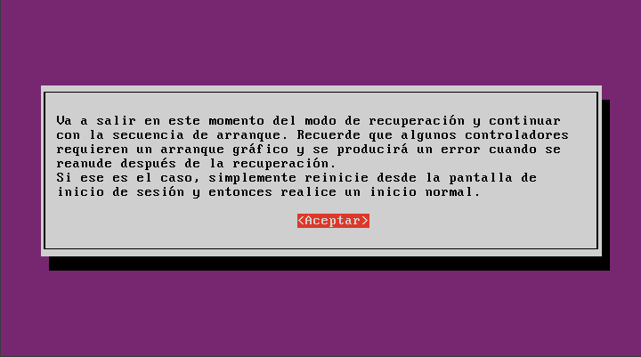

Quan haguem canviat la contrasenya podrem continuar en el menú anterior a la primera opció; “resume”

---

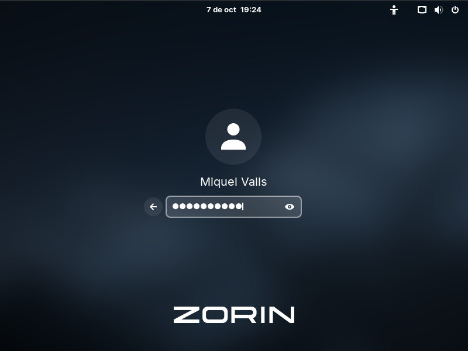

Tornarem a iniciar la màquina pero aquesta vegada podrem posar la contrasenya que haguem posat en l'usuari per iniciar sessió

---

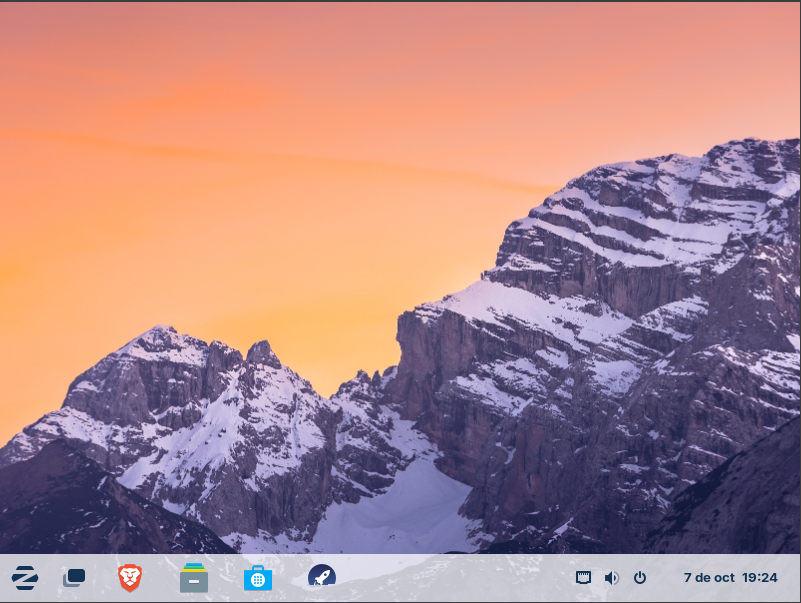

I ja haurem accedit a l’escriptori i haurem canviat la contrasenya de l’usuari

---

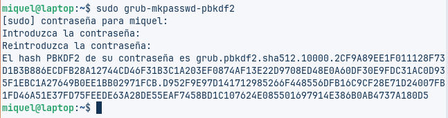

Quan ja estiguem dintre, obrim la terminal i amb la següent comanda ens donarà el hash de la nostra contrasenya

---

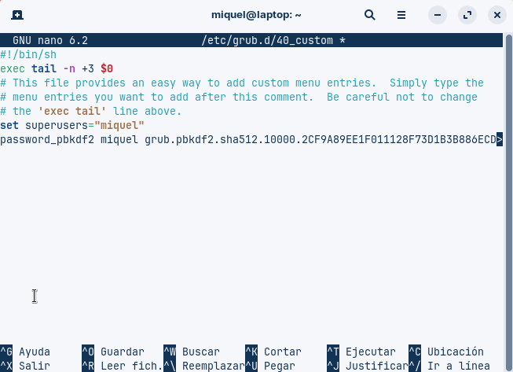

Farem “sudo nano /etc/grub.d/40_custom” i escriurem el hash que ens havia donat la comanda anterior

---

Actualitzarem grub amb la primera comanda, després posarem una de les dues comandes següents. Serveixen per crear un nou arxiu de configuració

---

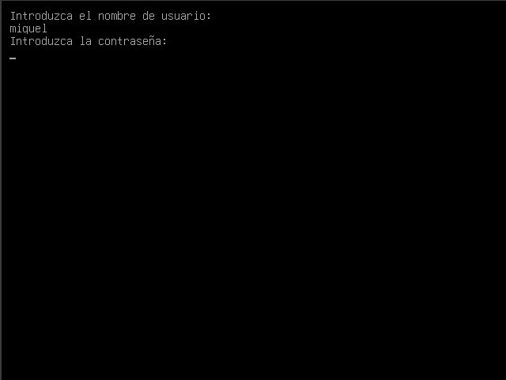

Tornem a iniciar la màquina i veurem que ens surt una terminal on ens demana l’usuari i la contrasenya

---

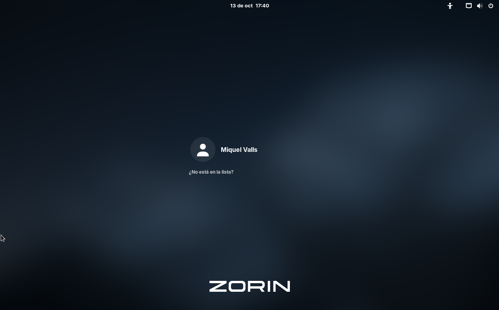

I si posem l’usuari i la contrasenya correctament ens deixarà iniciar sessió en la màquina virtual de Zorin

---
